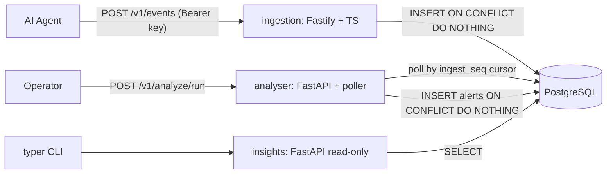

# Design and Trade-offs

> Skeleton. Each section lists the raw material to rewrite in your own voice before submitting.

## System overview

Three independent processes sharing one Postgres instance. There is no message broker: the `events` table, ordered by a monotonic `ingest_seq`, *is* the queue.

## Data model

_(Describe `agents`, `events`, `alerts`, `analysis_cursor`. Call out the `payload` vs `raw` split and the two uniqueness constraints that carry the idempotency guarantees.)_

## How the requirements are met

| Requirement                                   | Approach                                                                       |
| --------------------------------------------- | ------------------------------------------------------------------------------ |
| Store structured fields and the raw payload    | `events.payload` (validated/normalised) alongside `events.raw` (as submitted)   |
| Only trusted clients can submit                | Static env-configured API keys, constant-time comparison, `client_id` recorded  |
| Repeated submissions do not duplicate          | `events.event_id` primary key with `INSERT ... ON CONFLICT DO NOTHING`          |
| Events can arrive out of order                 | `occurred_at` separate from `received_at`; analyser polls `ingest_seq`, not time |
| Bodies up to a few hundred KB                  | Fastify `bodyLimit` of 512 KB, `413` beyond it                                  |
| Never hang on slow or malformed requests       | `requestTimeout` and `connectionTimeout`, strict schema parse before any I/O    |
| Environment-based configuration                | zod-validated config in TS, pydantic-settings in Python, fail fast at boot      |
| Troubleshooting logs                           | pino with request ids; validation failures log the offending fields, not bodies  |
| No duplicate alerts on re-analysis             | `UNIQUE (event_id, rule)` with `ON CONFLICT DO NOTHING`                         |

## Trade-offs

Raw material to rewrite in your own words:

- **Postgres table as the queue** instead of Kafka, Redis, or NATS. Fine at prototype scale; it is a single point of contention, gives no fan-out, and puts a latency floor at the poll interval.
- **Polling by `ingest_seq` rather than `occurred_at`**, which is what makes out-of-order arrival safe. A late event with an old timestamp still gets a fresh high sequence number and is picked up. The cost is that a cursor rewind reprocesses work, mitigated by the alert unique constraint.
- **Idempotency pushed into the database** (`PK` on `event_id`, `UNIQUE(event_id, rule)`) rather than application-level checks. Free and race-proof, but it couples correctness to the schema, and renaming a rule silently resets its dedupe history.
- **Static env-based API keys** with constant-time comparison instead of mTLS, OIDC, or HMAC request signing. Right for a prototype, but keys are long-lived, unrotatable, and unscoped. The honest next step is HMAC-signed bodies with a timestamp, which also buys replay protection at the transport layer.
- **Storing both normalised `payload` and untouched `raw`.** Doubles storage and lets the two drift, but preserves forensic fidelity and allows re-parsing historical events after a schema change.
- **Three separate processes rather than one.** Better isolation and independent scaling; more moving parts to run, and cross-service refactors are harder. Mitigated on the Python side by `packages/pycommon`, but the TypeScript side duplicates the entity shapes.
- **No shared schema registry between TypeScript and Python.** Generating types from JSON Schema was considered and skipped for time, so the event contract is enforced twice and can drift.
- **SQL in `initdb.d` rather than Alembic or node-pg-migrate.** Zero setup and readable in review, but no upgrade path and no rollback, so any schema change means a volume reset.
- **Rules as a plugin protocol rather than a config-driven DSL.** Easy to unit test in isolation and cheap to extend, but changing anything not lifted into env config requires a deploy.
- **Synchronous `psycopg` rather than async**, despite FastAPI. The workload is DB-bound batch processing, not high-concurrency I/O, and sync code is simpler to test. The poller runs in a thread executor so it never blocks the event loop.
- **Severity as a Postgres enum**, so `MAX(severity)` works in SQL. Adding a level later is a migration.
- **The insights service is read-only by convention but shares one database credential.** A separate read-only role is the obvious hardening step.
- **No auth on the insights or analyser APIs**, since they are operator-facing and bound to the Compose network.
- **Test strategy**: rules are pure functions with heavy unit coverage; everything touching SQL is integration-tested against real Postgres, with mocked drivers used only for a couple of error paths. Slower suite, far higher confidence in the SQL, which is where the real risk lives.

## What I would do next

_(Suggestions: outbox or LISTEN/NOTIFY to drop poll latency; per-agent rate limiting on ingestion; alert suppression and grouping so one noisy agent cannot flood the feed; a read-only DB role for insights; real migrations; OpenTelemetry traces spanning all three services.)_
