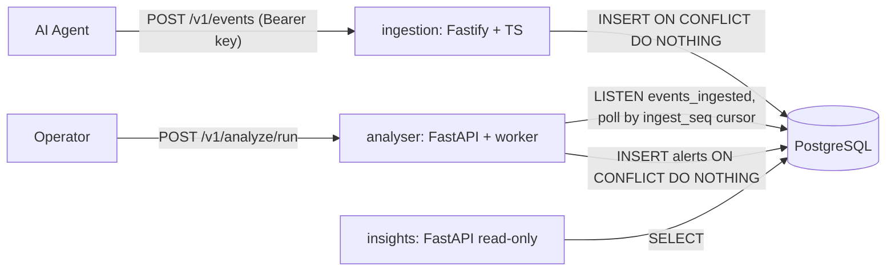

# Design and Trade-offs

## System overview

Three independent processes sharing one Postgres instance. There is no message broker: the `events` table, ordered by a monotonic `ingest_seq`, *is* the queue. The analyser waits on a `NOTIFY` raised by an insert trigger so it normally reacts within milliseconds, and falls back to a timed poll so a missed notification costs latency rather than correctness.

## Data model

Four tables, defined in `db/migrations/001_init.sql` and applied by Postgres' `docker-entrypoint-initdb.d` on a fresh volume.

**`agents`** — one row per agent, upserted on every ingest to maintain `first_seen_at` and `last_seen_at`. It exists so insights can enumerate agents and answer "when was this one last heard from" without scanning `events`.

**`events`** — the log, and the queue. Two columns matter more than the rest:

- `event_id` is the primary key, and that *is* the deduplication mechanism. Ingestion writes `INSERT ... ON CONFLICT (event_id) DO NOTHING` and reports a zero row count back to the caller as a duplicate, so a client retrying after a timeout gets the same answer as the first attempt without a read-then-write race.
- `ingest_seq` is a `BIGSERIAL` monotonic in *arrival* order, deliberately distinct from `occurred_at`, which the agent controls and can backdate. The analyser advances along `ingest_seq`, so an event that arrives an hour late still receives a fresh high sequence number and is picked up on the next pass. Ordering by `occurred_at` would have silently skipped it.

`payload` and `raw` hold the same event twice on purpose. `payload` is the validated, normalised form that rules read, so a rule never has to defend against a missing field. `raw` is the envelope exactly as submitted and is never rewritten, which preserves forensic fidelity and lets historical events be re-parsed after the schema changes. The cost is roughly double the storage and two representations that can disagree.

**`alerts`** — rule findings, one row per `(event, rule)` pair, enforced by `UNIQUE (event_id, rule)` and written with `ON CONFLICT DO NOTHING`. That constraint is what makes re-analysis safe: rewinding the cursor or running a backfill over events that already produced alerts is a no-op rather than a duplicate feed. `severity` is a Postgres enum declared in ascending order, so `MAX(severity)` and `severity >= 'high'` work directly in SQL.

**`analysis_cursor`** — a single-row watermark holding the highest `ingest_seq` the analyser has processed, pinned to one row by `CHECK (id = 1)`. It is advanced in the same transaction as the alert inserts it accounts for, so a crash mid-batch rolls back both and the batch is simply retried. That gives at-least-once processing, which the alert unique constraint upgrades to effectively exactly-once.

## How the requirements are met

| Requirement                                   | Approach                                                                       |
| --------------------------------------------- | ------------------------------------------------------------------------------ |
| Store structured fields and the raw payload    | `events.payload` (validated/normalised) alongside `events.raw` (as submitted)   |
| Only trusted clients can submit                | Static env-configured API keys, constant-time comparison, `client_id` recorded  |
| Repeated submissions do not duplicate          | `events.event_id` primary key with `INSERT ... ON CONFLICT DO NOTHING`          |
| Events can arrive out of order                 | `occurred_at` separate from `received_at`; analyser polls `ingest_seq`, not time |
| Bodies up to a few hundred KB                  | Fastify `bodyLimit` of 512 KB, `413` beyond it                                  |
| Never hang on slow or malformed requests       | `requestTimeout` and `connectionTimeout`, strict schema parse before any I/O    |
| Environment-based configuration                | zod-validated config in TS, pydantic-settings in Python, fail fast at boot      |
| Troubleshooting logs                           | pino with request ids; validation failures log the offending fields, not bodies  |
| No duplicate alerts on re-analysis             | `UNIQUE (event_id, rule)` with `ON CONFLICT DO NOTHING`                         |

## Trade-offs

- **Postgres table as the queue** instead of Kafka, Redis, or NATS. Fine at prototype scale, and `LISTEN/NOTIFY` keeps the latency floor off the poll interval. But it is a single point of contention, gives no fan-out to a second consumer group, and `NOTIFY` is fire-and-forget — a listener that is down misses the wakeup entirely, which is why the timed poll stays as a backstop rather than an optimisation.
- **Polling by `ingest_seq` rather than `occurred_at`**, which is what makes out-of-order arrival safe. A late event with an old timestamp still gets a fresh high sequence number and is picked up. The cost is that a cursor rewind reprocesses work, mitigated by the alert unique constraint.
- **Idempotency pushed into the database** (`PK` on `event_id`, `UNIQUE(event_id, rule)`) rather than application-level checks. Free and race-proof, but it couples correctness to the schema, and renaming a rule silently resets its dedupe history.
- **Static env-based API keys** with constant-time comparison instead of mTLS, OIDC, or HMAC request signing. Right for a prototype, but keys are long-lived, unrotatable, and unscoped. The honest next step is HMAC-signed bodies with a timestamp, which also buys replay protection at the transport layer.
- **Storing both normalised `payload` and untouched `raw`.** Doubles storage and lets the two drift, but preserves forensic fidelity and allows re-parsing historical events after a schema change.
- **Three separate processes rather than one.** Better isolation and independent scaling; more moving parts to run, and cross-service refactors are harder. Mitigated on the Python side by `packages/pycommon`, but the TypeScript side duplicates the entity shapes.
- **No shared schema registry between TypeScript and Python.** Generating types from JSON Schema was considered and skipped for time, so the event contract is enforced twice and can drift.
- **SQL in `initdb.d` rather than Alembic or node-pg-migrate.** Zero setup and readable in review, but no upgrade path and no rollback, so any schema change means a volume reset.
- **Rules as a plugin protocol rather than a config-driven DSL.** Easy to unit test in isolation and cheap to extend, but changing anything not lifted into env config requires a deploy.
- **Synchronous `psycopg` rather than async**, despite FastAPI. The workload is DB-bound batch processing, not high-concurrency I/O, and sync code is simpler to test. The poller runs in a thread executor so it never blocks the event loop.
- **Severity as a Postgres enum**, so `MAX(severity)` works in SQL. Adding a level later is a migration.
- **The insights service is read-only by convention but shares one database credential.** A separate read-only role is the obvious hardening step.
- **No auth on the insights or analyser APIs**, since they are operator-facing and bound to the Compose network.
- **Test strategy**: rules are pure functions with heavy unit coverage; everything touching SQL is integration-tested against real Postgres, with mocked drivers used only for a couple of error paths. Slower suite, far higher confidence in the SQL, which is where the real risk lives.

## What I would do next

Roughly in the order I would actually do them:

1. **Real migrations.** `initdb.d` only runs on an empty volume, so today any schema change means destroying the database. A tool with an upgrade path (Alembic, or node-pg-migrate) is the prerequisite for every other item here being deployable.
2. **A read-only role for insights.** The service is read-only by convention and by code review, not by permission. It shares one superuser-ish credential with the two writers, so a bug or an injection there is a write. This is a `CREATE ROLE ... GRANT SELECT` and a second connection string.
3. **Per-agent rate limiting on ingestion**, plus alert suppression and grouping. Nothing currently stops one misbehaving agent from filling the events table or drowning the alert feed, and an alert feed nobody can read is the same as no alert feed.
4. **HMAC-signed request bodies with a timestamp**, replacing static bearer keys. Keys today are long-lived, unrotatable, and unscoped; signing also buys replay protection at the transport layer rather than relying on `event_id` deduplication to absorb it.
5. **A shared event schema between TypeScript and Python.** The contract is currently enforced twice, by hand, in two languages, and nothing fails when the two drift. Generating both sides from one JSON Schema removes an entire class of silent bug.
6. **OpenTelemetry traces spanning all three services**, so "why did this alert take 40 seconds" is a question with an answer. Request ids exist in ingestion logs but stop at the database.
